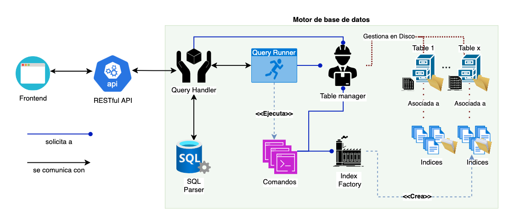

# Gestor de Base de Datos - Proyecto Universitario

## Descripción
Sistema de gestión de bases de datos desarrollado para el curso de Base de Datos II, implementando una arquitectura de tres capas con énfasis en el rendimiento de consultas mediante indexación y capacidad de importación de datos desde archivos CSV.

## Autores
- Sergio Cortez
- Carlos Sobenes

## Arquitectura
```
.
├── src/
│   ├── db/           # Motor de base de datos
│   ├── api/          # API REST en Flask
│   └── frontend/     # Interfaz de usuario en React
```

## Diagrama de Flujo de Consultas


### Flujo de Consultas
1. **Interfaz de Usuario** → El usuario interactúa con la interfaz React, que envía consultas SQL o archivos CSV mediante llamadas HTTP.

2. **Capa API** → El servidor Flask actúa como intermediario:
   - Recibe y valida las peticiones
   - Encapsula la comunicación con el motor de base de datos
   - Gestiona las respuestas y errores

3. **Motor de Base de Datos** → El procesamiento sigue una ruta bien definida:
   - El `QueryHandler` recibe la consulta y actúa como punto de entrada
   - El parser analiza la sintaxis y genera una representación estructurada
   - El query runner ejecuta el comando asociado a la consulta procesada.
   - El comando correspondiente:
     * Selecciona la estrategia de acceso (índices o secuencial) 
     * Realiza operaciones sobre los datos
     * Gestiona el almacenamiento en disco
   - Para importación CSV:
     * Se analiza la estructura del archivo
     * Se crea una tabla con el esquema apropiado
     * Importamos los datos optimizando el almacenamiento

4. **Flujo de Retorno** → Los resultados atraviesan el camino inverso:
   - El motor empaqueta los resultados
   - La API los formatea en JSON
   - La interfaz los presenta de manera amigable

## Componentes Principales

### Motor de Base de Datos
- Operaciones CRUD
- Indexación:
  - B+Tree
  - Sequential File
- Tipos de datos soportados: INT, VARCHAR, DATE, ARRAY
- Importación desde CSV con inferencia de tipos
- Estrategia de reindexación:
  - Mantiene índices actualizados durante operaciones DELETE
  - Reconstrucción completa de datos e índices cuando los registros marcados como eliminados alcanzan el 20%

### API REST
- Endpoints para operaciones de base de datos
- Manejo de consultas en lote
- Soporte para carga de archivos CSV
- Validación y gestión de errores

### Frontend
- Interfaz interactiva en React
- Editor de consultas SQL
- Visualización de resultados
- Carga y visualización de archivos CSV
- Gestión visual de tablas e índices

## Tecnologías
- Backend: Python (Flask)
- Frontend: React + Vite
- Estilos: Tailwind CSS

## Requisitos
Ver `requirements.txt` (backend) y `package.json` (frontend)

## Ejemplo de Uso
```sql
-- Crear tabla desde CSV
CREATE TABLE FROM CSV 'datos.csv';

-- Consultas típicas
CREATE TABLE Usuarios (...);
SELECT * FROM Usuarios WHERE edad BETWEEN 25 and 33;
```